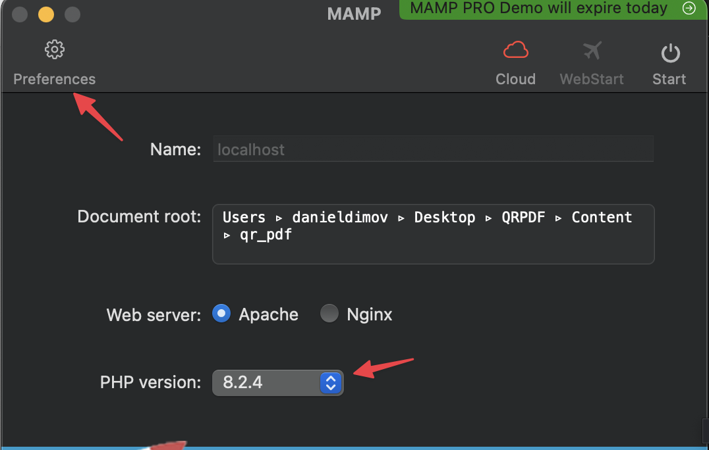
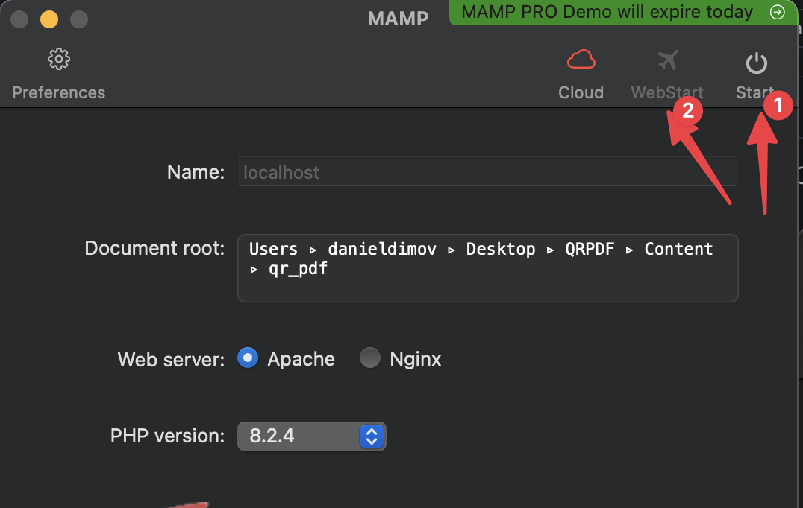

# Run local

## Install in MAMP, WAMP, XAMMP

You  can easily install the project locally if you use [MAMP](https://www.mamp.info/), [WAMP](https://sourceforge.net/projects/wampserver/) (Window only) or [XAMMP](https://www.apachefriends.org/download.html).&#x20;

In this example / guide, we will use [MAMP](https://www.mamp.info/),  but should be similar in the other tools.&#x20;


### Step 1 - Setup MAMP

First, extract the  zip that contains the project source code, that you download from CodeCanyon.

&#x20;Next install MAMP on you computer.

You will be  presented with screen like this one.&#x20;

Make sure PHP version is 8.1+

Then click on preferences

<figure><figcaption></figcaption></figure>

Go in the server tab, and in the  "Document root" choose the folder  where you extracted the code.

Click OK. &#x20;

<figure><figcaption></figcaption></figure>

MAMP  is now set up.&#x20;

Click on  start button and then on WebStart button.&#x20;

<figure><figcaption></figcaption></figure>

### Step 2 - Database creation

You  will be presented with  a page like this one.&#x20;

<figure><figcaption><p>Click on  Tools -> phpMyAdmin to create your database. </p></figcaption></figure>

<figure><figcaption><p>Click on new, and then enter your database name. Remember the name</p></figcaption></figure>

### Step 3 - Install

<figure><figcaption><p>Next, go back to  start page, and click on "My Website"</p></figcaption></figure>

<figure><figcaption><p>Install will now start. Click on "Next step"</p></figcaption></figure>

<figure><figcaption><p>In case you get permission errors. Open the file manager and change permission on the folders</p></figcaption></figure>

<figure><figcaption><p>Do this for all the listed folders</p></figcaption></figure>

<figure><figcaption><p>After permissions are ok, click on "Next step"</p></figcaption></figure>

<figure><figcaption><p>Enter database port, and database name. Enter desired admin user and pass.</p></figcaption></figure>

There are two other screens, that you can click on "Next step"

After that install is done

<figure><figcaption><p>You can visit the landing page. or the login page</p></figcaption></figure>

You can visit the landing page. or the login page


## Run local - Docker way

From Laravel 8, there is a new package available called [https://laravel.com/docs/8.x/sail](https://laravel.com/docs/8.x/sail).

We use this to run the site locally and test it.

#### Step 1 - Install Docker

All you need is to install [https://www.docker.com/](https://www.docker.com/) on your computer.

After that extract the code and open it in the Terminal / Command prompt

```
cd PROJECT_NAME
./vendor/bin/sail up
```

The first time you run this can take some time

#### Step 2 - Install via CMD

After sail is running, open a new terminal window and navigate to the project.

execute

```
sail artisan migrate --fresh --seed
```

This will set up ( seed ) the database.

Then execute / run

```
cd storage
touch installed
```

This should create an empty file in **storage** folder, to let the system know that the project is installed. Then open the site on [localhost](http://127.0.0.1).

You should see the site now

Login with the default credentials

**Username**: admin@example.com

**Password**: secret
